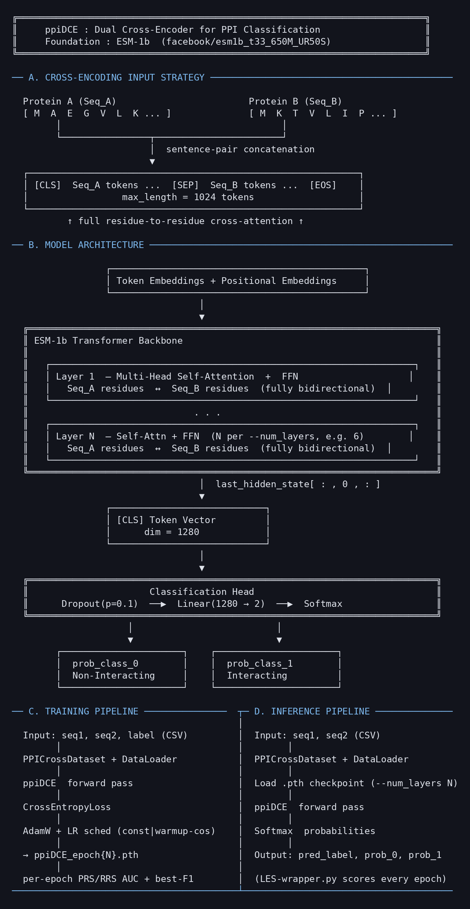

# ppiDCE

A dual cross-encoder for binary protein-protein interaction (PPI) classification, inspired by the ESM-1b transformer architecture ([Rives et al., 2021](https://doi.org/10.1073/pnas.2016239118)) but **substantially modified and trained from scratch** rather than fine-tuned from the released ESM-1b checkpoint.



## Overview

ppiDCE adapts the ESM-1b transformer architecture -- a single-sequence masked language model with no native PPI capability -- for protein-protein interaction prediction by exploiting the tokenizer's sentence-pair encoding mode and training the modified model from scratch on PPI data. Both protein sequences are concatenated into a single input as `[CLS] Seq_A [SEP] Seq_B [EOS]`, so the encoder's bidirectional self-attention spans the joint sequence and the two proteins attend to one another at every layer (inter-protein attention; this is the cross-encoder property, not a separate cross-attention module). The `[CLS]` token representation from the final layer captures joint inter-protein features and is passed through a dropout + linear classification head to produce binary interaction predictions with softmax probabilities.

The model was developed for the *Prochlorococcus marinus* MED4 interactome, where it serves as one component of a tri-model consensus framework (alongside [ppiGPLM](https://github.com/kouroshSA/ppiGPLM) and [ppiBTEP](https://github.com/kouroshSA/ppiBTEP)) for computational PPI screening.

## Architecture

| Parameter | Value |
|-----------|-------|
| Foundation | BERT/ESM-1 base — ESM-1b-architecture transformer (Rives et al., 2021), substantially modified, trained from scratch (not the released ESM-1b weights) |
| Strategy | Cross-encoding (sentence-pair) |
| Layers | 12 (configurable) |
| Classification | [CLS] -> Dropout(0.1) -> Linear -> 2 |
| Max sequence length | 1,024 tokens |
| Optimizer | AdamW (lr = 2 x 10^-5) |
| Loss | Cross-Entropy |

### Cross-Encoding vs Single-Sequence

Unlike the original ESM-1b which processes one protein at a time, ppiDCE feeds both proteins as a single concatenated input. This enables inter-protein residue-residue attention at every transformer layer -- the most expressive strategy for modeling pairwise interactions, at the cost of O((n+m)^2) attention complexity.

## Installation

### Prerequisites

- Python 3.10+
- CUDA-capable GPU (recommended)
- conda (recommended) or pip

### Setup

```bash
# Clone the repository
git clone https://github.com/kouroshSA/ppiDCE.git
cd ppiDCE

# Create a conda environment
conda create -n esm python=3.10
conda activate esm
pip install -r requirements.txt
```

## Repository Structure

```
ppiDCE/
|-- train_ppiDCE.py                    # Training script
|-- inference_ppiDCE.py                # Batch inference script
|-- roc_analysis_color_threshold_F1e.py  # ROC curve analysis with F1 optimization
|-- assets/
|   +-- ppiDCE.png                     # ASCII workflow diagram
|-- requirements.txt
|-- LICENSE
+-- README.md
```

## Usage

### Data Format

Training and inference use CSV files with columns: `protein1_seq, protein2_seq, label`

- `protein1_seq`, `protein2_seq`: Amino acid sequences
- `label`: `0` (non-interacting) or `1` (interacting)

For inference-only input, only the first two columns are required.

### Training

```bash
# Train from scratch with 12 layers
python train_ppiDCE.py \
    --train_file train.csv \
    --val_file val.csv \
    --model_config facebook/esm1b_t33_650M_UR50S \
    --from_scratch \
    --num_layers 12 \
    --epochs 10 \
    --batch_size 2 \
    --learning_rate 2e-5 \
    --max_length 1024 \
    --output_dir ./out \
    --device cuda
```

#### Key training options

- `--from_scratch`: Initialize the ESM backbone with random weights instead of
  loading pretrained ESM-1b. Useful when you suspect single-sequence
  pretraining priors are inappropriate for your task.
- `--num_layers N`: Set total transformer layers when training from scratch
- `--freeze_layers N`: Freeze bottom N layers during fine-tuning
- `--add_layers N`: Append extra transformer layers on top
- `--checkpoint path.pth`: Resume from a saved checkpoint
- `--suppress_warnings`: Suppress tokenizer truncation warnings

### Quick start: fetch the checkpoint from Hugging Face

The released MED4 checkpoint (`checkpoints/ppiDCE_epoch8.pth`, 12-layer)
lives on this Hugging Face repo. Pull it without cloning the GitHub mirror:

```python
from huggingface_hub import hf_hub_download

ckpt_path = hf_hub_download(
    repo_id="kouroshSA/ppiDCE",
    filename="checkpoints/ppiDCE_epoch8.pth",
)
print(ckpt_path)   # pass this string to --model_path
```

`inference_ppiDCE.py` takes the checkpoint path as a direct `--model_path`
argument, so no rename or specific directory layout is required — point
it straight at the file you just downloaded.

### Input file format

The inference script expects a CSV with two columns of plain amino-acid
sequences (one protein pair per row — no delimiter tokens, no length
markers, no chevrons):

```
seq1,seq2
MKLR...QSH,MSEDF...VKN
MQAG...PIA,MTRRL...EEP
```

A ready-made example is shipped with the repo:
[`MED4-PPIs-low-confidence_ppiTEPM_prompts.csv`](MED4-PPIs-low-confidence_ppiTEPM_prompts.csv).
The PRS/RRS reference sets ship in [`MED4_PRS-RRS/`](MED4_PRS-RRS) — 10 matched
replicates, `PRS-V3-{1..10}.csv` / `RRS-V3-{1..10}.csv`, each two columns
(`seq1,seq2`), 100 pairs, no label column.

### Inference

```bash
python inference_ppiDCE.py \
    --model_path checkpoints/ppiDCE_epoch8.pth \
    --model_config facebook/esm1b_t33_650M_UR50S \
    --input_file MED4-PPIs-low-confidence_ppiTEPM_prompts.csv \
    --output_file predictions.csv \
    --batch_size 4 \
    --max_length 1024 \
    --device cuda
```

Output CSV columns: `seq1, seq2, pred_label, prob_0, prob_1`

### ROC Analysis

Evaluate model predictions using ROC curve analysis with threshold-colored visualization and F1 optimization:

```bash
python roc_analysis_color_threshold_F1e.py \
    --input_csv probabilities.csv \
    --output_file roc_curve.png
```

The input CSV should have two columns: PRS (positive) and RRS (random/negative) probability values.

## Architecture Diagram

The ASCII workflow diagram (`assets/ppiDCE.png`) covers:
- **A.** Cross-encoding input strategy
- **B.** Model architecture (BERT/ESM-1 base backbone + classification head)
- **C.** Training pipeline
- **D.** Inference pipeline

> Note: the diagram shows Softmax in the classification head for clarity, but
> the implementation returns raw logits — softmax is applied implicitly by
> CrossEntropyLoss during training and explicitly during inference.

## Citation

If you use this software, please cite:

```
Daakour, S. et al. (2026).
```

## License

This project is licensed under the MIT License. See [LICENSE](LICENSE) for details.
